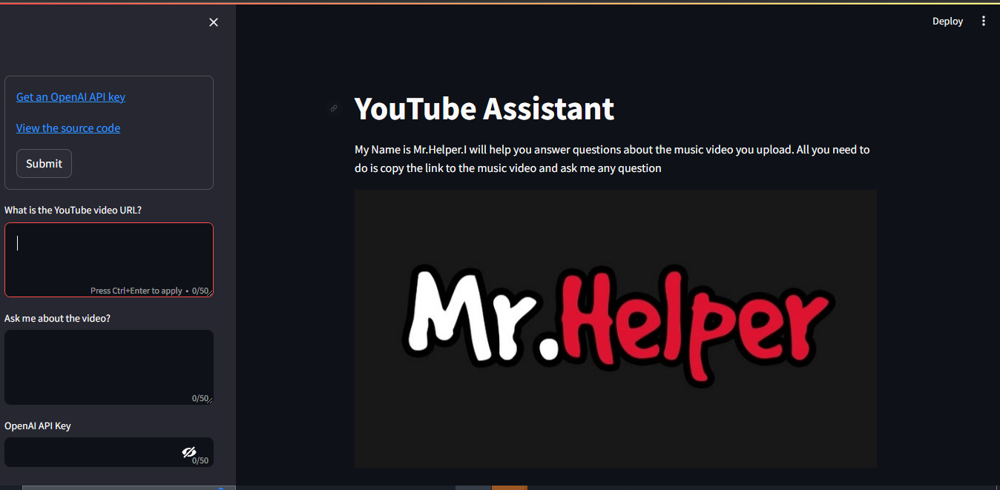
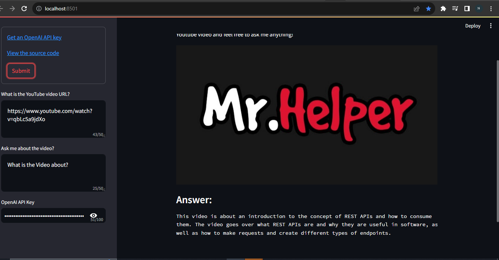

# Youtube Assistant
This is a powerful YouTube assistant that allows you to extract insights and answers from your favorite videos using advanced language models.

# App Interface




# Setup
You need Python on your system to setup this app. Then you can clone this repo and being at the repo's root.

Let start by cloning the repository in your local machine:

``````
git clone https://github.com/Newton23-nk/Youtube_Helper_Langchain.git
``````
Then we will create a virtual environment and install the libraries required, contained in the requirements file:

Windows
``````
    python -m venv venv; venv\Scripts\activate; python -m pip install -q --upgrade pip; python -m pip install -qr requirements.txt 
``````

Linux & MacOs
``````
    python3 -m venv venv; source venv/bin/activate; python -m pip install -q --upgrade pip; python -m pip install -qr requirements.txt
``````  

# Run the App
Launch the app using Streamlit:
``````
streamlit run main.py
``````